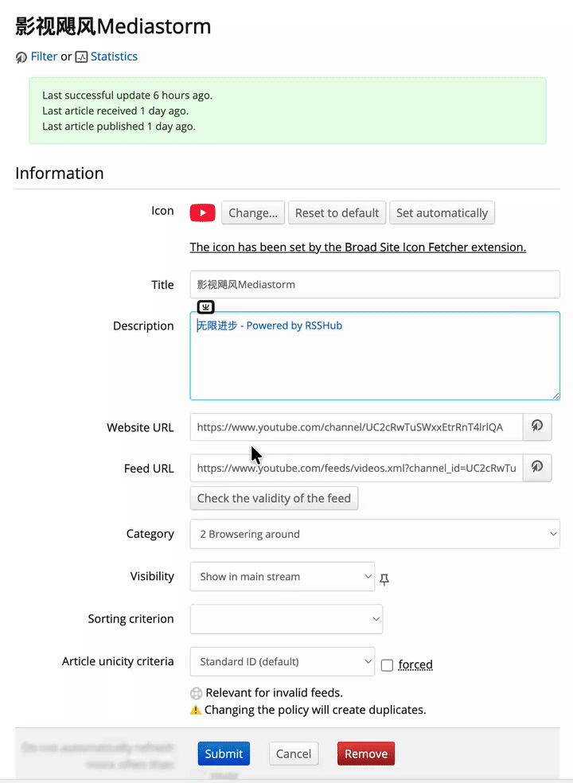
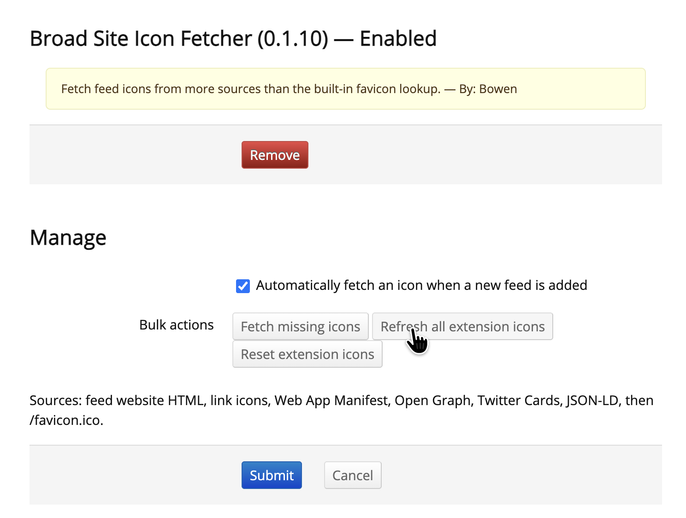

# FreshRSS Broad Site Icon Fetcher

[English](README.md)

一个 FreshRSS 第三方扩展，用来从 RSS 元数据、YouTube 频道页、网站、Manifest 等更多来源获取订阅源图标。

## 功能

- **RSS/Atom 频道图标，包括 RSSHub**：优先读取订阅源的频道图标，例如 RSSHub 的 `channel.image.url`（XML 中为 `channel/image/url`）。
- **YouTube 频道头像**：将 YouTube 视频订阅源定位到频道页，使用频道头像而不是 YouTube 的通用 favicon。
- **更广泛的 HTML 解析**：支持 `icon`、`shortcut icon`、`apple-touch-icon`、`mask-icon`、`fluid-icon` 和 `image_src`。
- **现代元数据**：支持 Web App Manifest、Open Graph、Twitter Cards 和 JSON-LD。
- **安全回退链**：最后回退到站点 `/favicon.ico`，并由 FreshRSS 校验图片。
- **自动、单订阅源与批量操作**：新订阅自动获取；可在 FreshRSS 图标对话框中刷新单个订阅源；也提供补齐、刷新和重置批量操作。
- **保护用户图标**：不会覆盖用户明确上传的自定义图标。
- **原生 FreshRSS 集成**：复用 FreshRSS 的 HTTP、代理、缓存、图标存储和扩展 Hook。

## 图标来源优先级

1. RSS/Atom 频道图标，包括 RSSHub 的 `channel.image.url`
2. `youtube.com/feeds/videos.xml?channel_id=...` 对应的 YouTube 频道头像
3. HTML 中的 link 图标
4. Web App Manifest 的 `icons`
5. Open Graph、Twitter Card 和通用图片元数据
6. JSON-LD 的图片、Logo 和图标字段
7. `/favicon.ico`

支持相对 URL、协议相对 URL、HTML `<base>`，以及 JSON/XML 订阅源响应。

## 截图与动图演示

### 单个订阅源操作



### 批量操作



## 安装

### Git 安装

```bash
cd /path/to/FreshRSS/extensions
git clone https://github.com/bowencool/xExtension-BroadIconFetcher.git
```

### 手动安装

1. 下载[最新 Release](https://github.com/bowencool/xExtension-BroadIconFetcher/releases)或仓库 ZIP。
2. 解压到 FreshRSS 的 `extensions/` 目录。
3. 如有需要，将目录名改为 `xExtension-BroadIconFetcher`。

### 启用

1. 在 FreshRSS 中打开“配置 → 扩展”。
2. 启用“Broad Site Icon Fetcher”。
3. 打开扩展设置，调整自动获取选项或执行批量操作。

## 配置与图标操作

| 操作 | 说明 |
| --- | --- |
| **添加新订阅时自动获取图标** | 启用新订阅 Hook，默认开启。 |
| **刷新单个订阅源** | 在订阅源的图标对话框中使用扩展操作，只重新获取该订阅源的图标。 |
| **补齐缺失图标** | 处理没有本扩展图标文件的订阅。 |
| **强制刷新扩展图标** | 重新请求并覆盖本扩展管理的图标。 |
| **重置扩展图标** | 只删除本扩展设置的图标，保留用户上传的图标。 |

## 工作流程

```text
FreshRSS feed Hook
        |
        v
读取订阅源并解析 RSS/Atom 的 channel.image.url
        |
        +--> 成功：下载并存储频道图标
        +--> YouTube 视频订阅源：将频道页头像加入候选
        +--> 继续检查 HTML、Manifest、元数据、JSON-LD 和 favicon.ico
        |
        v
由 FreshRSS 校验并存储自定义图标
```

## 开发

无需安装依赖或构建。要求 PHP 8.1+、FreshRSS，以及 PHP 的 `curl`、`dom` 和 `fileinfo` 扩展。

GitHub Actions 会在每次推送时运行相同检查。推送新的 `v*` 标签后，lint 成功即自动创建 GitHub Release。

```bash
php -l extension.php
php -l configure.phtml
php -l i18n/en/ext.php
php -l i18n/zh-cn/ext.php
node --check static/icon-fetcher.js
python3 -c 'import json; json.load(open("metadata.json")); print("metadata.json: valid")'
```

## 项目结构

```text
xExtension-BroadIconFetcher/
├── extension.php
├── configure.phtml
├── metadata.json
├── static/icon-fetcher.js
├── screenshots/               # README 截图和演示素材
├── i18n/
├── .github/workflows/ci.yml  # CI 和标签自动发版
├── LICENSE
├── README.md
└── README.zh-CN.md
```

## 贡献与许可

欢迎 Fork、创建 feature 分支、运行检查命令并提交 Pull Request。本项目采用 [GNU Affero General Public License v3.0](LICENSE) 授权。
